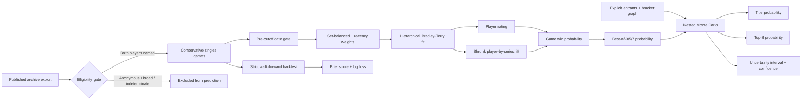

# Archive-backed tournament simulator — internal methodology

> Experimental internal prototype. This archive-backed probabilistic simulator
> is separate from the bundled six-model seed-scenario explorer currently shown
> on the website. It is retained as candidate work for roadmap item 8; it is
> neither the source of the current Riptide bracket graphic nor the reviewed
> Scuffed World Tour retrospective simulator pilot that completed item 7 for
> the accepted scope.

## Model choice

The prototype model is a regularized hierarchical Bradley–Terry model.
It estimates the log-odds that player A wins a game against player B as:

```text
rating[A] - rating[B]
+ series_lift[A, event_series] - series_lift[B, event_series]
```

Player ratings use moderate L2 shrinkage. Player-by-series effects use much
stronger shrinkage, so a player cannot become a “Riptide specialist,” “GENESIS
specialist,” or equivalent on the strength of a few games. The same machinery
works for every event series in the registry; Riptide is only an example.

The implementation is dependency-free, deterministic, and interpretable. It
lives in `scripts/lib/tournament-forecast.mjs` and is invoked through
`scripts/build-tournament-forecast.mjs`.

## Pipeline visualization



## Data gates

Training accepts only rows that satisfy all of these conditions:

- Singles format.
- `verified` or `probable` conservative curation tier.
- Both replay slots resolve to public `archive_players` identities.
- A determinate winner exists.
- The effective event/game date is on or before the forecast cutoff.
- A player cannot play themselves.

Raw replays, paths, filenames, connect codes, unresolved tags, and private user
identifiers are neither needed nor read by this stage. Anonymous games remain
valuable for Community aggregates, but they do not affect named-player
forecasts.

Games remain the modeling unit because bracket matches have best-of-three,
best-of-five, or best-of-seven lengths. To prevent long sets from dominating,
the weights of all eligible games in one inferred/verified set sum to one.
Standalone named games receive weight one.

## Dates and recency

The builder prefers a sourced tournament `start_date`. If one is unavailable,
it accepts a replay day only when its year agrees with the cited tournament
year. A year-only event receives December 31 as a conservative fallback; this
prevents an event known only to have happened “in 2026” from entering a model
cut off in June 2026.

Historical games receive exponential recency weights with a two-year half-life:

```text
weight = 0.5 ^ (age_in_days / 730)
```

The half-life and both shrinkage penalties are recorded in the private model-run
row so a forecast remains reproducible.

## Partial pooling and series lift

The objective is weighted logistic loss plus two penalties:

```text
loss
+ 2  / 2 * sum(player_rating ^ 2)
+ 12 / 2 * sum(player_series_lift ^ 2)
```

The stronger series penalty is deliberate. Tournament-series effects combine
venue familiarity, travel, era, bracket selection, and noise; they are useful
predictively but are not causal claims. The UI must not label someone a series
specialist solely from the raw coefficient. A later specialist view should also
require multiple editions and a meaningful named-game/set sample.

The optimizer is damped diagonal Newton iteration. The objective is convex and
the run records whether the convergence threshold was reached.

## Validation

Validation is chronological walk-forward, never a random train/test split.
Each test event day is predicted using only earlier event days. The report gives:

- Brier score: squared probability error; lower is better.
- Log loss: strongly penalizes confident wrong predictions; lower is better.
- A neutral 50/50 baseline for both metrics.
- Coverage where both test players had appeared in the preceding training data.

No game from the target event may leak into its own pre-event forecast. A model
that does not improve on simple baselines should not be published merely because
it produces plausible-looking percentages. Seeds are not yet a fitted feature;
they enter through bracket position. A later model can compare against a seeded
Elo baseline before adding more features.

The builder refuses to generate forecast rows until all initial readiness gates
pass: at least 100 fully named conservative games, at least eight modeled
players, at least 100 walk-forward predictions, convergence, and improvement
over the neutral baseline on both Brier score and log loss. `--validate-only`
still reports the fit and the exact blockers when coverage is below this floor.

## Forecast simulation and uncertainty

The input is an explicit topologically ordered bracket graph. A source can be a
direct player, a prior match winner, or a prior match loser, which supports both
single- and double-elimination structures. Optional conditional matches support
grand-final resets. Each match declares its best-of length.

Simulation is nested:

1. Draw player ratings and series effects from a diagonal Laplace approximation.
2. Simulate many complete brackets for that parameter draw.
3. Repeat across parameter draws.
4. Report overall title/top-eight frequencies and the 2.5th–97.5th percentiles
   of draw-level title probabilities.

The seed is explicit, so identical data, settings, and bracket input produce
identical probabilities. Confidence combines interval width, total named games,
and same-series sample size. It is not a guarantee of forecast correctness.

## Commands

Validate and backtest the current public export without creating a forecast:

```bash
node scripts/build-tournament-forecast.mjs --validate-only
```

Print a complete example input shape:

```bash
node scripts/build-tournament-forecast.mjs --print-example
```

Run an explicit event bracket:

```bash
node scripts/build-tournament-forecast.mjs \
  --event /absolute/path/to/forecast-event.json \
  --output /absolute/path/to/forecast-export
```

`--input` can point to another generated public-export directory. `--cutoff`
is optional, but when present it must exactly match the event file's
`dataCutoff`.

Stage the forecast alongside a first archive load:

```bash
node scripts/load-public-archive.mjs \
  --forecast-dir /absolute/path/to/forecast-export
```

After the base dataset is already published, stage or publish only a new
versioned forecast ID with:

```bash
node scripts/load-public-archive.mjs \
  --forecast-only \
  --forecast-dir /absolute/path/to/forecast-export \
  --publish
```

The loader refuses to overwrite an already-published forecast ID. Forecast
publication uses a separate service-role RPC that checks the expected player
count, probability sums, published player references, model cutoff, and base
dataset before exposing the event and player rows in one transaction. The
forecast manifest carries the archive's SHA-256 content fingerprint in addition
to its manifest timestamp and table counts. Both the forecast builder and loader
recompute that digest from the exact NDJSON bytes before use, preventing an
older, mixed, or modified forecast/archive bundle from being paired with a
rebuilt dataset that reused the same date-based dataset ID.

## Forecast input schema

`--print-example` is the canonical executable example. Its structure is:

```json
{
  "id": "example-open-2027",
  "canonicalName": "Example Open 2027",
  "seriesId": null,
  "startDate": "2027-06-12",
  "entrantSourceUrl": "https://www.start.gg/tournament/example-open-2027/attendees",
  "bracketSourceUrl": "https://www.start.gg/tournament/example-open-2027/event/melee-singles/brackets",
  "dataCutoff": "2027-06-10",
  "simulationCount": 25000,
  "randomSeed": "example-open-2027-v1",
  "entrants": [
    { "playerId": "player-1", "seed": 1 },
    { "playerId": "player-2", "seed": 2 }
  ],
  "bracket": {
    "matches": [
      {
        "id": "F",
        "left": { "playerId": "player-1" },
        "right": { "playerId": "player-2" },
        "bestOf": 5
      }
    ],
    "top8From": [
      { "playerId": "player-1" },
      { "playerId": "player-2" }
    ],
    "championFrom": { "winnerOf": "F" }
  }
}
```

Every entrant must already have a public `archive_players` row. Each entrant
must appear directly in exactly one bracket source. Later matches refer to prior
matches with `{ "winnerOf": "MATCH_ID" }` or `{ "loserOf": "MATCH_ID" }`.
`top8From` must explicitly describe the eight qualification sources (or every
entrant when the field has fewer than eight entrants).

A conditional grand-final reset can be represented as:

```json
{
  "id": "GF_RESET",
  "left": { "winnerOf": "GF" },
  "right": { "loserOf": "GF" },
  "bestOf": 5,
  "playIf": { "matchId": "GF", "winnerSide": "right", "onFalse": "left" }
}
```

## Outputs and visibility

The builder emits three Supabase-ready NDJSON files plus a local manifest:

- `archive_model_runs.ndjson`: private fit configuration and validation report.
- `archive_forecast_events.ndjson`: public event-level provenance and cutoff.
- `archive_forecast_players.ndjson`: public probabilities, interval, and
  low/medium/high confidence label.
- `forecast-manifest.json`: local row counts and validation summary.

The Supabase schema denies `anon` and `authenticated` access to
`archive_model_runs`. Public clients can read only explicitly published event
and player forecast rows. Publishing should remain a separate, deliberate step
after inspecting validation and bracket provenance.

## Known limitations and next upgrades

- The current archive identity coverage is the binding constraint. External
  bracket/VOD mapping should improve named coverage before forecasts are treated
  as broadly representative.
- The diagonal uncertainty approximation ignores coefficient covariance and is
  intentionally conservative only through shrinkage, not a full Bayesian fit.
- Character matchup and stage are omitted from v1 because a future bracket's
  character/stage choices are conditional. Add them only after walk-forward
  tests demonstrate out-of-sample improvement.
- Execution metrics (L-cancel, tech, and move usage) remain explanatory. They
  should enter prediction only if pre-event, leakage-safe validation improves.
- Entrant and bracket changes require a new forecast input and model run cutoff;
  stale forecasts must show their cutoff prominently.
